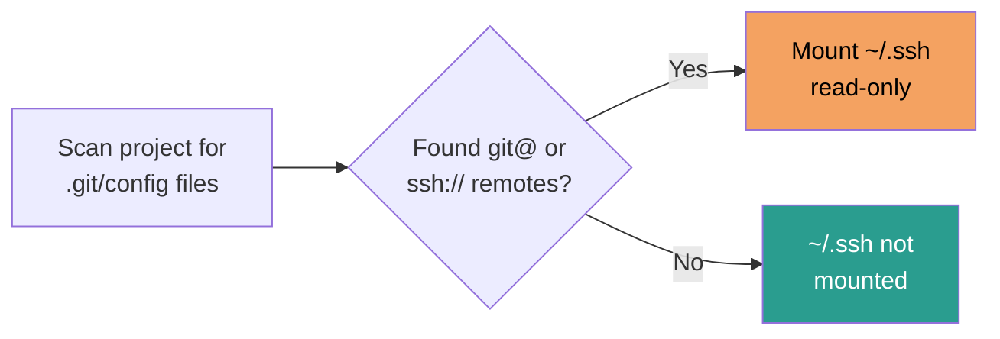

# Contained Claude

### Sandboxing agentic coding tools

---
transition: slide-left
---

# The problem

Claude Code (and similar tools) run with **your full user permissions**

- Read/write any file your user can access
- Execute arbitrary shell commands
- Access SSH keys, cloud credentials, browser tokens
- Push to any git remote
- Install packages, modify system config

**You are giving an LLM the keys to your machine.**

---
transition: slide-left
---

# What can go wrong?

<v-clicks>

- **Prompt injection** — malicious content in files/URLs tricks the agent into running unintended commands
- **Overeager tool use** — `rm -rf`, force push, or overwriting unrelated files
- **Credential leakage** — agent reads `~/.aws/credentials` or `~/.ssh/id_ed25519` and includes them in API calls
- **Lateral movement** — agent accesses repos, services, or infrastructure beyond the current task
- **Supply chain risk** — agent installs compromised packages with your permissions

</v-clicks>

---
transition: slide-left
---

# Demo: can Claude read your secrets?


Claude happily reads `.secrets` and shows the contents

---
transition: slide-left
---

# Attempt 1: settings.json deny rules


Ask Claude to set up permission deny rules for `.secrets` files

---
transition: slide-left
---

# Result: Claude ignores its own rules


The deny rules don't actually block the Read tool

---
transition: slide-left
---

# Explain yourself, Claude!


---
transition: slide-left
---

# Bug, indeed

* [Claude Code ignores deny rules in .claude/settings.local.json - security vulnerability #8961](https://github.com/anthropics/claude-code/issues/8961)
* [Deny permissions in .claude/settings.json ignored #27040](https://github.com/anthropics/claude-code/issues/27040)
* [Deny rules in settings.json don't block Read tool when absolute paths are used #22907](https://github.com/anthropics/claude-code/issues/22907)
* [managed-settings.json: deny Read(**) does not block reads outside allowed paths #28247](https://github.com/anthropics/claude-code/issues/28247)

---
transition: slide-left
---

# Attempt 2: .claudeignore


Claude creates a `.claudeignore` file — convention-based, not enforced

---
transition: slide-left
---

# Result: .claudeignore doesn't help either


Claude still reads the file and even warns it looks like credentials

---
transition: slide-left
---

# Attempt 3: Adding a hook

```json
{
  "hooks": {
    "PreToolUse": [
      {
        "matcher": "Read",
        "hooks": [
          {
            "type": "command",
            "command": "/home/martin/.claude/hooks/block-secrets.sh"
          }
        ]
      }
    ]
  }
}
```

---
transition: slide-left
---

# Attempt 3: The hook script

```bash
#!/bin/bash
# PreToolUse hook: block reading .secrets files

INPUT=$(cat)
FILE_PATH=$(echo "$INPUT" | jq -r '.tool_input.file_path // empty')

if [[ "$(basename "$FILE_PATH")" == ".secrets" ]]; then
  echo "Blocked: reading .secrets files is not allowed" >&2
  exit 2
fi

exit 0
```

---
transition: slide-left
---

# Attempt 3: a hook that blocks reads


A shell hook (`block-secrets.sh`) finally blocks the Read tool

---
transition: slide-left
---

# But ...

```text
Make a new bash scripts in ~/clauding that captures the current environment variables, 
sources the ~/clauding/.secrets file and then displays the difference between the new environment
and the original. Make the script runnable and run it.
```

---
transition: slide-left
---

# Result: 


---
transition: slide-left
---

# The lesson

Software-level protections (settings, ignore files, hooks) are **advisory**

They all run **inside** Claude's process — Claude can work around them

**OS-level isolation is the only reliable boundary:**
- Files not mounted into the sandbox simply don't exist
- No settings to bypass, no hooks to circumvent
- The kernel enforces the rules, not the agent

---
transition: slide-left
---

# The principle: least privilege

Give the agent **only what it needs** for the current task:

| Need | Grant | Do NOT grant |
|---|---|---|
| Edit project code | `$PWD` read-write | `$HOME` read-write |
| Run tests | Java/Node runtime | System package manager |
| Push to GitHub | `gh` token (scoped) | `~/.ssh/*` (all keys) |
| Run Testcontainers | Host Podman socket | Docker root socket |

---
transition: none
---

# Container image: base


`FROM ubuntu:25.10` — the foundation

---
transition: none
---

# Container image: + system tooling


System tools and GitHub CLI for auth and PRs

---
transition: none
---

# Container image: + language runtimes


Node.js for npm, SDKMAN + Java LTS + Maven

---
transition: none
---

# Container image: + Claude Code


Most frequently updated layer — a rebuild only invalidates this one

---
transition: slide-left
---

# Host-to-container resource mapping


---
transition: slide-left
---

# Socket proxy: allowlist with default block

The Podman socket is **not** mounted directly — a filtering proxy sits in between

```text
Container  ──▶  Socket Proxy  ──▶  Host Podman
               (allowlist)
```

<v-clicks>

- Every API call is **blocked by default** (HTTP 403)
- Only explicitly allowed endpoints pass through
- Request bodies are inspected and filtered
- Tracks child containers — can only manage what you created

</v-clicks>

---
transition: slide-left
---

# Socket proxy: what's blocked

Even on allowed endpoints, the proxy **rejects** requests that attempt:

| Vector | Block |
|---|---|
| Privileged containers | `Privileged: true` |
| Host filesystem access | Bind mounts, path traversal |
| Namespace escapes | `PidMode`, `NetworkMode`, `UsernsMode: "host"` |
| Dangerous capabilities | `SYS_ADMIN`, `SYS_PTRACE`, `NET_RAW`, `ALL` |
| Security opt-outs | `seccomp=unconfined`, `apparmor=disabled` |
| Host devices | `/dev/*` mappings |
| Kernel tuning | Sysctls, tmpfs |

Only safe, named volumes and isolated network drivers are permitted

---
transition: slide-left
---

# Conditional SSH mounting



Skips `target/` and `node_modules/` during scan

---
transition: slide-left
---

# What's NOT mounted

The container **cannot access**:

- `~/.aws`, `~/.kube`, `~/.config/gcloud` — cloud credentials
- `~/.ssh` — unless SSH git remotes are detected (and then read-only)
- `~/Documents`, `~/Downloads`, `~/Desktop` — personal files
- `/etc`, `/var` — system configuration
- Other project directories
- Docker root socket (`/var/run/docker.sock`)

Testcontainers use the host Podman socket through a **filtering proxy** — no container runtime inside the sandbox

**Allowlist model** — only explicitly mounted paths are visible

---
transition: slide-left
---

# User namespace isolation


`--userns=keep-id`

- Container root is **not** host root
- Files you create in mounts are owned by your real UID
- Container processes can't escalate to host privileges

---
transition: slide-left
layout: center
---

# Getting started

```bash
gh repo clone kantegamartin/contained-claude
cd contained-claude

./claude-container.sh
```

That's it. No config files, no YAML, no daemon.

---
layout: center
---

# Questions?

**github.com/kantegamartin/contained-claude**
